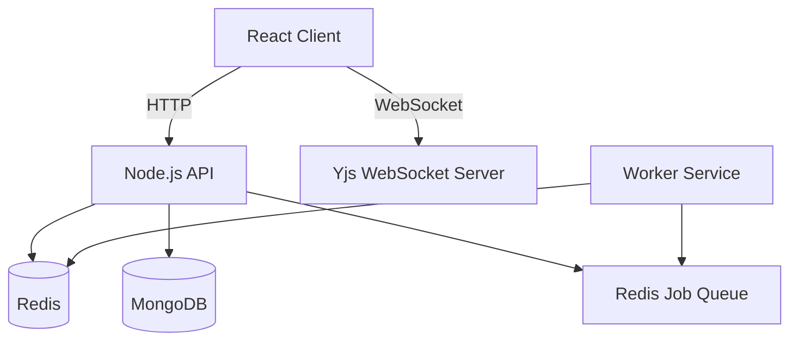

# Real-Time Collaborative Code Platform

A full-stack, real-time collaborative code editor that allows multiple users to edit, run, and debug code simultaneously in a shared environment. Designed for technical interviews, pair programming, and competitive coding.


[](https://your-app-name.vercel.app) 


> **Try it out here:** (https://collaborativecoder.vercel.app/)

A full-stack, real-time collaborative code editor...

## 🧐 The Problem

Remote pair programming and technical interviews often suffer from "friction fatigue."
1.  **Latency:** Screen sharing is laggy and blurs text.
2.  **Passive Observation:** "Pass the keyboard" doesn't work remotely; usually, only one person can type while the other watches passively.
3.  **Context Switching:** Users have to switch between a communication tool (Zoom/Slack) and a coding tool (IDE).
4.  **State Loss:** Most simple web editors lose the code if the browser tab is refreshed or the internet connection blinks.

## 💡 The Solution

This platform provides a **synchronized, stateful, and executable** environment:
* **Zero-Latency Collaboration:** Uses WebSockets to sync keystrokes instantly between clients.
* **Presence Awareness:** Visualizes remote cursors and selections so users know exactly where their peers are working.
* **Integrated Runtime:** A remote code execution engine (RCE) compiles and runs code (Python, C++, Java) on the server, broadcasting results to all users.
* **Resilience:** Implements a "Hot Cache" architecture using Redis to recover state immediately upon reconnection.

---

## 🏗️ Architecture & Engineering Trade-offs
### High-Level Architecture


### 1\. Synchronization Strategy: **CRDTs with Yjs**

**Decision:** We use **Conflict-Free Replicated Data Types (CRDTs)** via **Yjs** for real-time editor synchronization.

**Why CRDTs?**

-   In collaborative editing, users may **edit the same document concurrently**, even at the same position.

-   CRDTs guarantee **eventual consistency** without requiring a central authority or locks.

-   Offline edits merge deterministically once the client reconnects.

**Why Yjs?**

-   Proven, production-grade CRDT implementation

-   Efficient binary update protocol

-   Strong ecosystem support (Monaco bindings, awareness, persistence)

-   Deterministic merges with low overhead

**Design Choice:**

-   Editor text is fully managed by **Yjs**

-   A dedicated **`y-websocket-server`** handles CRDT synchronization

-   The main backend does **not** participate in text merging, keeping concerns isolated and scalable

* * * * *

### 2\. State Management: The "Hot Cache" Pattern

**Decision:** Use **Redis** for ephemeral, latency-sensitive state and **MongoDB** for durable persistence.

**The Problem:**\
Persisting every keystroke to MongoDB would overwhelm the database with high-frequency writes.

**The Solution:**

1.  **Real-time (Hot Path):**

    -   Execution jobs, Pub/Sub events, and transient state are handled in **Redis**

    -   Enables O(1) access and low-latency operations

2.  **Hydration:**

    -   On reconnect, clients restore state via Yjs sync and cached metadata

    -   Prevents stale data after refresh or network drops

3.  **Persistence (Cold Path):**

    -   Explicit save actions flush snapshots to **MongoDB**

    -   User history and room metadata are stored durably

This separation keeps the system fast while remaining reliable.

* * * * *

### 3\. Remote Code Execution (RCE)

**Decision:** Asynchronous execution via a **Redis-backed job queue**.

**Execution Flow:**

-   The API server never executes code directly (avoids blocking the event loop)

-   Code execution requests are pushed to a **Redis Queue**

-   A separate **Worker process**:

    -   Pulls jobs

    -   Executes code in an isolated environment

    -   Publishes results via Redis Pub/Sub

-   Results are broadcast back to clients in the room

This design ensures scalability, isolation, and responsiveness.

* * * * *

🛠️ Tech Stack
--------------

### Frontend

-   **React + TypeScript** --- Type-safe UI components

-   **Monaco Editor** --- VS Code--grade editing experience

-   **Yjs + y-websocket** --- CRDT-based collaboration and awareness

-   **Socket.io-client** --- Chat and execution events

-   **Tailwind CSS** --- Responsive UI styling

### Backend

-   **Node.js & Express** --- REST API

-   **Socket.io** --- Chat, presence, execution status

-   **Redis** --- Queues, Pub/Sub, ephemeral state

-   **MongoDB** --- Persistent storage

-   **Worker Service** --- Isolated code execution

* * * * *

✨ Key Features
--------------

1.  **CRDT-Based Multiplayer Editing** --- Conflict-free, real-time collaboration

2.  **Live Cursors & Selections** --- User awareness powered by Yjs

3.  **Live User List** --- Real-time presence updates

4.  **Integrated Group Chat** --- Discuss logic inline

5.  **Multi-Language Execution** --- Python, C++, Java, JavaScript

6.  **Automatic Recovery** --- Safe reconnection after network drops
---

## 🚀 Getting Started

### Prerequisites
* Node.js (v18+)
* Docker (Optional, for local Redis/Mongo)
* Redis Server
* MongoDB Instance

### Installation

1.  **Clone the repo**
    ```bash
    git clone [https://github.com/yourusername/collaborative-editor.git](https://github.com/yourusername/collaborative-editor.git)
    cd collaborative-editor
    ```

2.  **Install Dependencies**
    ```bash
    # Install server deps
    cd server
    npm install

    # Install client deps
    cd ../client
    npm install
    ```

3.  **Environment Variables**
    Create a `.env` file in the `server` directory:
    ```env
    PORT=5000
    MONGO_URL=mongodb://localhost:27017/collab-editor
    REDIS_URL=redis://localhost:6379
    ```

4.  **Run the App**
    ```bash
    # Run Server (starts API + Socket + Worker)
    cd server
    npm run dev

    # Run Client
    cd client
    npm run dev
    ```

## 🔮 Future Improvements
* **Voice Chat:** Integrating WebRTC for in-app audio communication.
* **Diff View:** Visualizing changes between saves.
* **syntax Highlighting:** Better support for more languages.

## 📄 License
Distributed under the MIT License. See `LICENSE` for more information.
